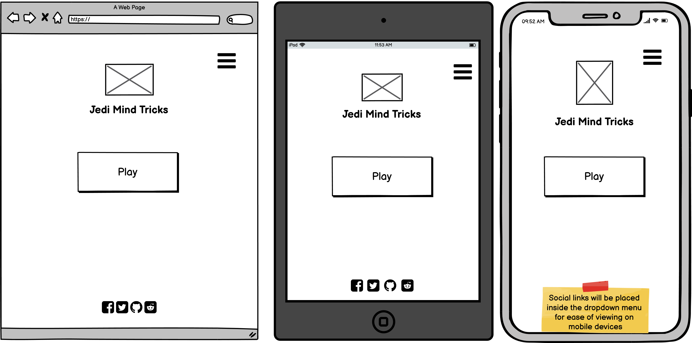
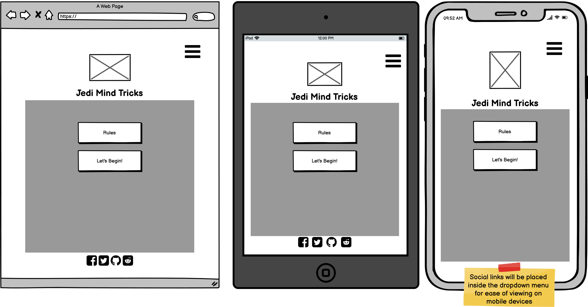
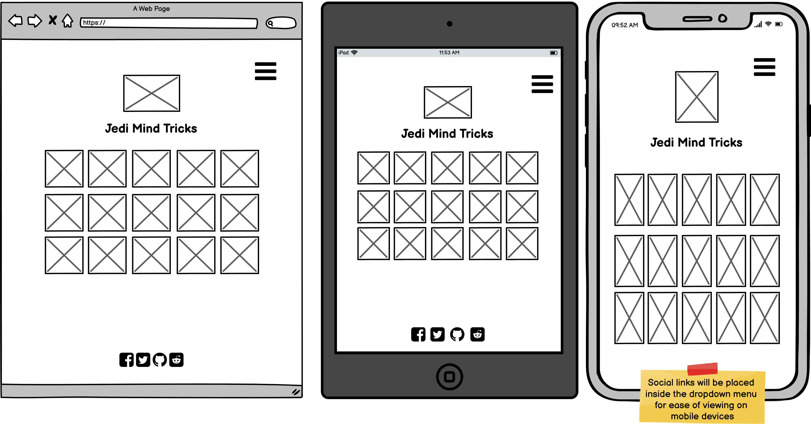
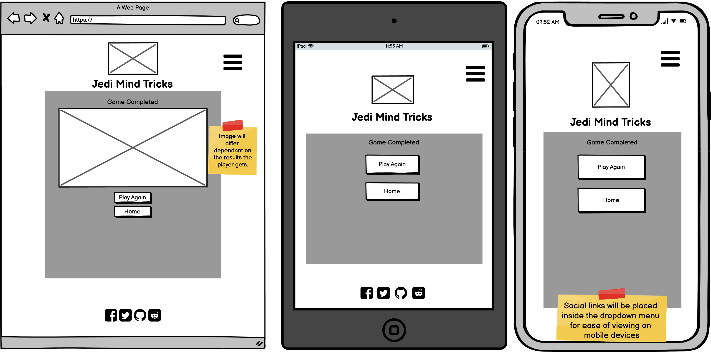

# Game
# Table of Contents
1. [Introduction](#Introduction)
2. [UX](#UX)
   * [Ideal User Demographic](#Ideal-User-Demographic)
   *  [User Stories](#User-Stories)
   *  [Development Planes](#Development-Planes)
   *  [Design](#Design)
3. [Features](#Features)
   * [Design Features](#Design-Features)
   * [Existing Features](#Existing-Features)
   * [Features to Implement in the future](#Features-to-Implement-in-the-future)
4. [Issues and Bugs](#Issues-and-Bugs)
5. [Technologies Used](#Technologies-Used)
   * [Main Languages Used](Main-Languages-Used)
   * [Frameworks, Libraries & Programs Used](#Frameworks,-Libraries-&-Programs-Used)
6. [Testing](#Testing)
   * [Testing.md](TESTING.md)
7. [Deployment](#Deployment)
   * [Deploying on GitHub Pages](#Deploying-on-GitHub-Pages)
8. [Credits](#Credits)
   * [Content](#Content)
   * [Media](#Media)
   * [Code](#Code)
9. [Acknowledgements](#Acknowledgements)

# Introduction

This game was designed as part of the Full Stack Developer course the developer is taking at Code Institute. The focus of the game is to develop peoples memory and to also ensure they're having fun whilst playing.

This is the first of four Milestone Projects for the developer that they must complete during their Full Stack Web Development Program at the Code institute.

The main languages that will be used during this project will be HTML5, CSS3 and JavaScript.

# UX

## Ideal User Demographic

* The main requirements for this project was to create a fun, easily playable and interactive game that would be enjoyed by anyone playing. The content in this game will be suitable for all ages. The target audience is considerable of all ages, though the game may appeal more to people intrested in science fiction content and more specifically fans of the frnachise Star Wars.

## User Stories

**Developer Goals**
  * The game should be easily understood and straightforward to use.
  * Easy accesiable rules of the games and how to play instructions.
  * Game appeals to players of all ages.
  * Make the game playable on all devices with little apperance changes to keep the look consistant for players on all devices.

**Player Goals**
  * I want to be able to, access straightforward instructions on how to play the game.
  * I want to be able to, return to the homepage with a single click.
  * I want to be able to, challenge myself with various stages of the game.
  * I want to be able to, compare myself to other players using the highscores.
  * I want to be able to, play the game with or without audio.

## Development Planes

In order to create a fun and enjoyable game the developer worked alongside some friends who were a variety of sci-fi fans and also some that had no intrests in that genre to ensure the goals listed above was applied to all of the players.

**Roles**
* People wanting to relax and play a simple game to challenge their memory
* Fans of Star Wars wanting to test their knowledge of the franchise
* Fans of Science Fiction looking to be introduced to Star Wars most commonly known Characters

**Demographic**
* 7 years old and higher
* Sci-fi and Star Wars fans testing their knowledge

**Personalities**
* Fun-Seeking
* Competitive

**Values**
* Enjoy Challenging themselves mentally
* Curious of trying a new genre of game

**Lifestyles**
* Fans of Sci-fi(Star Wars)

The website needs to let the user:
* Get the rules and information on how to play the game
* Be able to select different difficulties on the webiste
* Be able to compare themselves against other players
* Find social media platforms from the footer

The webiste needs to let the developer:
* Provide easy and accessiable rules for the game
* Provide easy to read and simple instructions for the players

## Skeleton

The developer used [Balsamiq](https://balsamiq.com/wireframes/ "Balsamiq Homepage") to create the wireframes for the website.

### Home Page

### Home Page Modal

### Gamepage

### Gamepage Modal

## Design

### Colour Scheme

The main colours used throughout the website are a black background with yellow text to keep the Star Wars theme consistant throughout each page. Also when hovering over buttons the colour will change to a orange to clearly show the user where their cursor is pointing.

### Typography

The pairing of fonts [Lato](https://fonts.google.com/specimen/Lato?preview.text_type=custom) and also [Gothic+A1](https://fonts.google.com/specimen/Gothic+A1) with Sans Serif being used as back-up should the fonts not be able to load due to an import fail.

Gothic A1 is being used throughout the site to keep the text consistent.

### Imagery