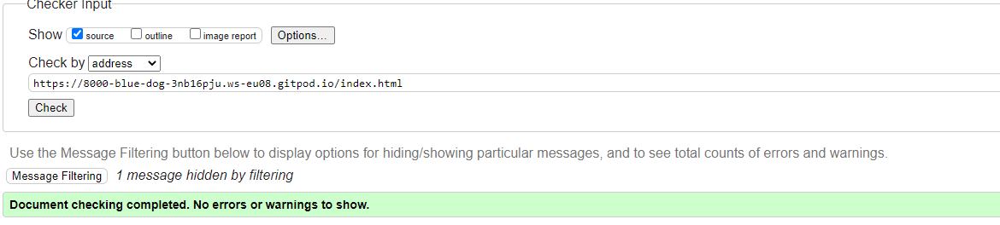
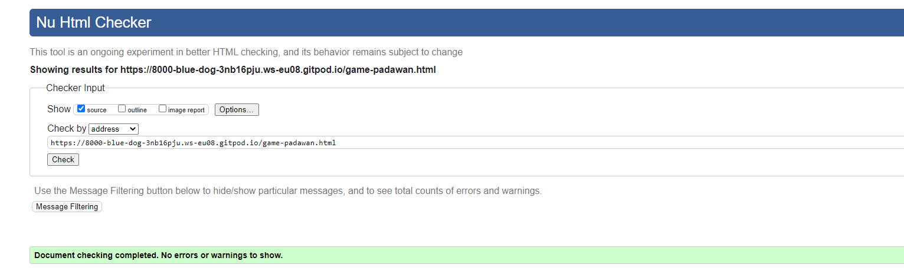
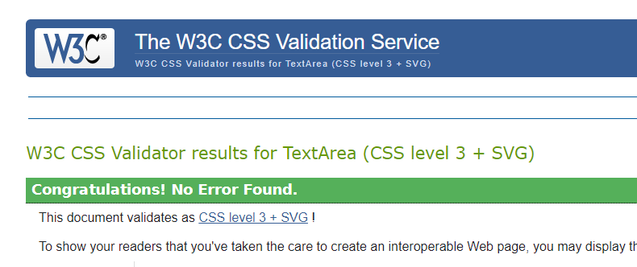

# Jedi Memory Game - Testing
[Main README.md File](README.md)

1. [Testing User Stories](#Testing-User-Stories)
2. [Manual Testing](#Manual-Testing)
3. [Automated Testing](#Automated-Testing)
   * [Code Validation](#Code-Validation)
   * [Browser Validation](#broswer-validation)
   * [Lighthouse Audit](#Lighthouse-Audit)
4. [User Testing](#User-Testing)

## Testing User Stories

### **Players Goals**:
  * I want to be able to, access straightforward instructions on how to play the game.
    * The rules are easily accessable from the homepage modal and are brief and straightforward to understand in a matter of seconds.
  * I want to be able to, return to the homepage with a single click.
    * This is easily achieved by clicking on the logo placed in the top center of every page and will direct the player to the homepage of the website instantly.
  * I want to be able to, challenge myself with various stages of the game.
    * The game comes in 3 levels all described in the rules section of the homepage modal telling the players what each level will consist of, all levels have different time restrictions too.
  * I want to be able to, play the game with or without audio.
   * Developer ran out of time when coming to implement this feature on the website, which is disappointing as they woudl of included more iconic quotes from the franchise of Star Wars.

## Manual Testing

### Common Elements Testing.
The developer manually tested the following effects to ensure they are displayed and functioning properly.

* Hovering on the navigation bar will trigger the **'hover'** effect and also to confirm the link the users are on.

* Hovering over Social Media links will trigger the **'hover'** effect and once clicked will open a new tab.

  * YouTube:
  
  * Reddit:
  
  * LinkedIn:
  
  * GitHub:
  

## Homepage

### Manual testing was performed on the following elements of the [Homepage](index.html)

* The responsiveness of the Homepage:

## Padawan Level Page

### Manual testing was performed on the following elements of the [Padawan Level Page](game-padawan.html)

* Responsiveness of the Padawan Level:

## Jedi Knight Level Page

### Manual testing was conducted by the developer on the following elements of the [Jedi Knight Level Page](game-knight.html)

### Responsiveness of the [Jedi Knight Page](game-knight.html)

* Responsiveness of the Jedi Knight Level:

## Jedi Master Level Page

### Manual testing was conducted by the developer on the following elements of the [Jedi Master Level Page](game-master.html)

* Responsiveness of the Jedi Master Level:

### Responsiveness of the [Jedi Master Page](game-master.html)

## Automated Testing

### Code Validation

The developer used the website [W3C Markup Validation Service](https://validator.w3.org/nu/) to review each page.

Here are the results from the tests:

* Homepage: 

* Padawan Level Page: 

* Knight Level Page: 

* Master Level Page: 

The developer used the website [W3C CSS Validation Service](https://jigsaw.w3.org/css-validator/) to validate their CSS.

* Here are the results from the test:

### Browser Validation

* Chrome - [Chrome Image]()
* Safari - [Safari Image]()
* Firefox - [Firefox Image]()
* Opera - [Opera Image]()
* Edge - [Edge Image]()

### Lighthouse Audit

Click [Here]() for the report on the Lighthouse Audit.

### User Testing
