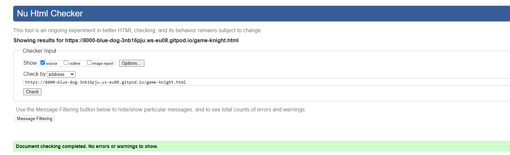
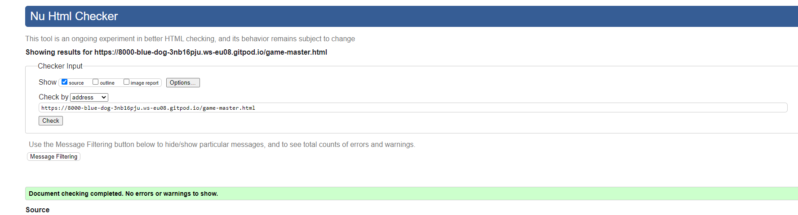
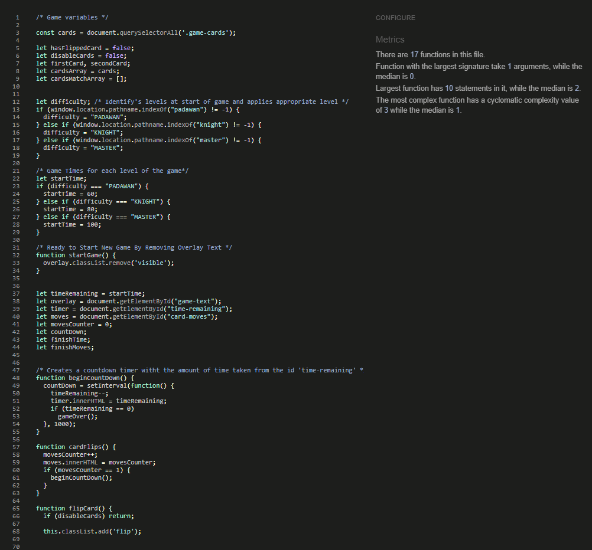
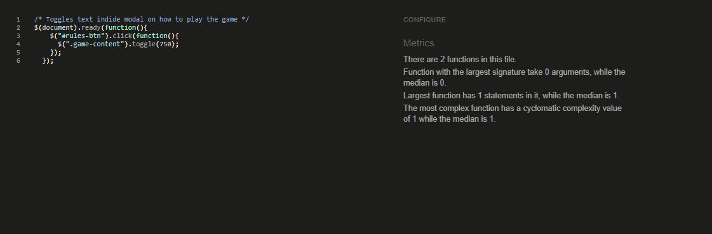

# Jedi Memory Game - Testing
[Main README.md File](README.md)

1. [Testing User Stories](#Testing-User-Stories)
2. [Manual Testing](#Manual-Testing)
3. [Automated Testing](#Automated-Testing)
   * [Code Validation](#Code-Validation)
   * [Browser Validation](#Broswer-Validation)
   * [Lighthouse Audit](#Lighthouse-Audit)
4. [User Testing](#User-Testing)

## Testing User Stories

### **Players Goals**:
  * I want to be able to, access straightforward instructions on how to play the game.
    * The rules are easily accessable from the homepage modal and are brief and straightforward to understand in a matter of seconds.
  * I want to be able to, return to the homepage with a single click.
    * This is easily achieved by clicking on the logo placed in the top center of every page and will direct the player to the homepage of the website instantly.
  * I want to be able to, challenge myself with various stages of the game.
    * The game comes in 3 levels all described in the rules section of the homepage modal telling the players what each level will consist of, all levels have different time restrictions too.
  * I want to be able to, play the game with or without audio.
   * Developer ran out of time when coming to implement this feature on the website, which is disappointing as they would of included more iconic quotes and sound effects from the Star Wars franchise.

## Manual Testing

### Common Elements Testing.
The developer manually tested the following effects to ensure they are displayed and functioning properly.

* Hovering over Social Media links will trigger the **'hover'** effect and once clicked will open a new tab.

  * YouTube:
  
  * Reddit:
  
  * LinkedIn:
  
  * GitHub:
  

## Homepage

### Manual testing was performed on the following elements of the [Homepage](index.html)
When clicking on the logo located in the top center of the page.

When clicking on the button in the middle of the page a modal will open with options for the users.

When the user clicks anywhere outside the modal, the modal will close and return the the homepage.

When clicking on the "How To Play" button the text will display with a scroll effect with rules on how to play the game.
 

When the user is inside the home modal when clicking "New Game" the current modal will close and open another with the different levels avaliable to play.

When the user selects the "Padawan" button they will be taken to the Padawan level of the game.

When the user selects the "Jedi Knight" button they will be taken to the Jedi Knight level of the game.

When the user selects the "Jedi Master" button they will be taken to the Jedi Master level of the game.

* The responsiveness of the Homepage:

## Padawan Level Page

### Manual testing was performed on the following elements of the [Padawan Level Page](game-padawan.html)

When first arriving at the Padawan Level page there will be a message that once clicked anywhere on the screen will disappear.

When clicking on the logo located in the top center of the page.

The timer will only start to count down when the first move has been made and the move counter has begun keeping count.

When the player has made a pair the cards will stay turned over.

When the player doesn't find two matching cards the cards will then flip back over.

When the player has found all the matching pairs of cards they will be greeted with a winning modal and will display the time left and the amount of moves it took to win the game.

When in the winning modal the player can choose to "Play Again" and when the button is clicked they will be taken to the welcome message.

When clicking on the "Become a Jedi Knight" button the user will be taken to the "Jedi Knight" level welcome message.

When clicking on the home button inside the winning modal the user will be taken back to the homepage of the website.

When the timer hits 0 the game is over and the player will be met with the game over modal.

When the player is met with the game over modal they can choose to play again and will be greeted with the welcome message once more.

If the player wants to return to the homepage after the game over modal they can click the Homepage button in the modal.

* Responsiveness of the Padawan Level:

## Jedi Knight Level Page

### Manual testing was conducted by the developer on the following elements of the [Jedi Knight Level Page](game-knight.html)

When the player arrives at the Jedi Knight page they will be greeted with a welcome message that when clicked anywhere on the page will close.

When clicking on the logo at the top center of the page the user will be taken back to the homepage.

The countdown will only start once the move counter has reached begun counting.

When succesfully pairing two cards they will stay flipped face side up.

When the user doesn't make a match the cards will flip back over.

### Responsiveness of the [Jedi Knight Page](game-knight.html)

* Responsiveness of the Jedi Knight Level:

## Jedi Master Level Page

### Manual testing was conducted by the developer on the following elements of the [Jedi Master Level Page](game-master.html)

When arriving at the Jedi Master page the user will be greeted with a welcome message that when they click on the page will disappear.

When succesfully pairing two cards they will stay flipped face side up.

If the cards do not match they will flip back over face down.

### Responsiveness of the [Jedi Master Page](game-master.html)

* Responsiveness of the Jedi Master Level:

## Automated Testing

### Code Validation

The developer used the website [W3C Markup Validation Service](https://validator.w3.org/nu/) to review each page.

Here are the results from the tests:

* Homepage: 

* Padawan Level Page: 

* Knight Level Page: 

* Master Level Page: 

The developer used the website  to validate their CSS.

* Here are the results from the test:

* The developer used the website  to validate their JavaScript.
* Here are the results from the tests: .
* Here are the results from the tests: .

### Browser Validation

* Chrome - [Chrome Image](assets/testing-files/automated-testing/Chrome-ms2-compatibility.png)
* Safari - [Safari Image](assets/testing-files/automated-testing/Safari-ms2-compatibility.png)
* Firefox - [Firefox Image](assets/testing-files/automated-testing/Firefox-ms2-compatibility.png)
* Edge - [Edge Image](assets/testing-files/automated-testing/Edge-ms2-compatibility.png)

### Lighthouse Audit

Click [Here](assets/testing-files/automated-testing/HomePage-Lighthouse.pdf) for the Lighthouse Audit for the Home Page.

Click [Here](assets/testing-files/automated-testing/Padawan-Lighthouse.pdf) for the Lighthouse Audit for the Padawan Page.

Click [Here](assets/testing-files/automated-testing/Knight-Lighthouse.pdf) for the Lighthouse Audit for the Jedi Knight Page.

Click [Here](assets/testing-files/automated-testing/Master-Lighthouse.pdf) for the Lighthouse Audit for the Jedi Master Page.

### User Testing
